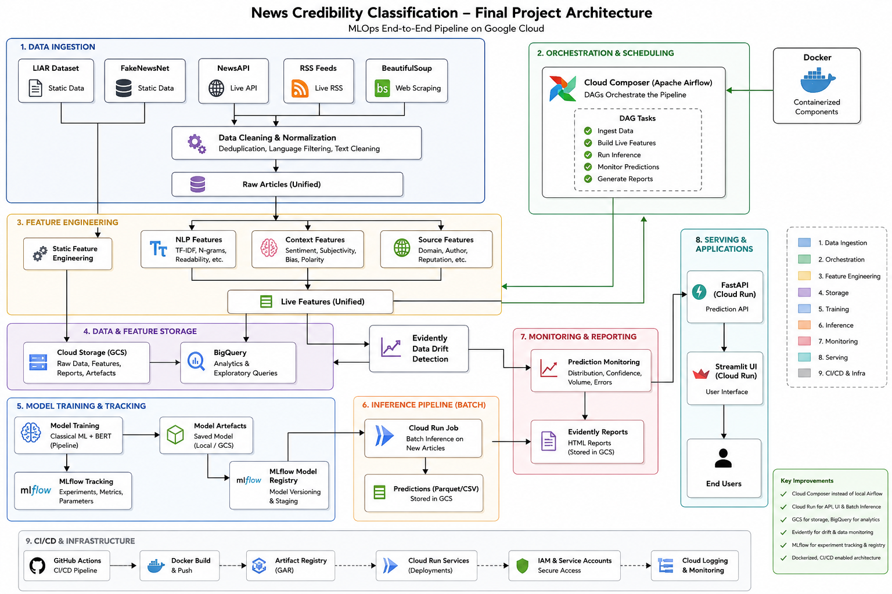
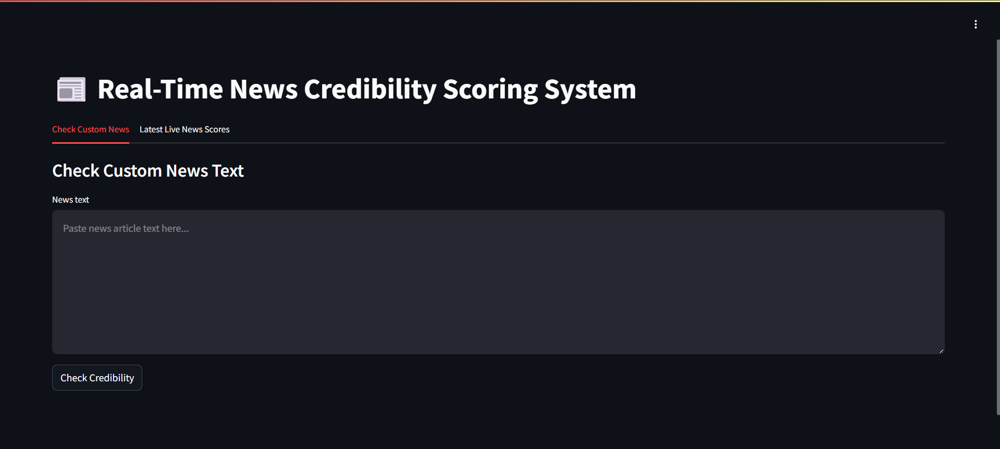
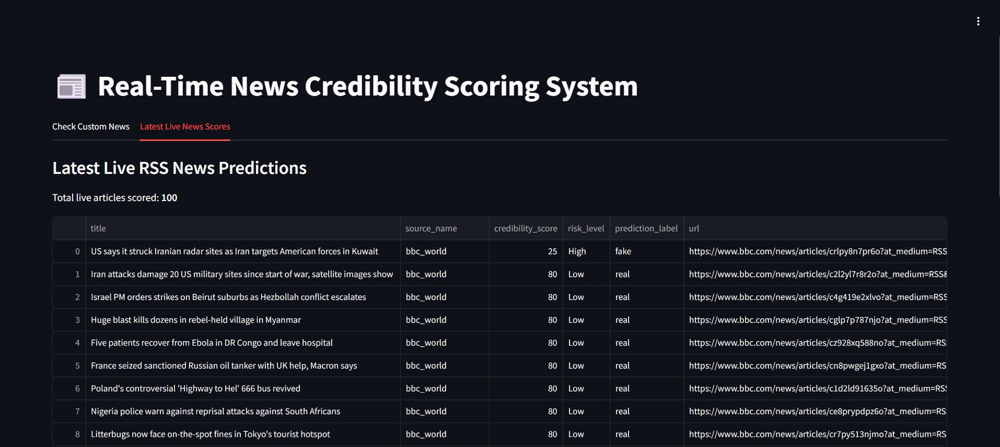
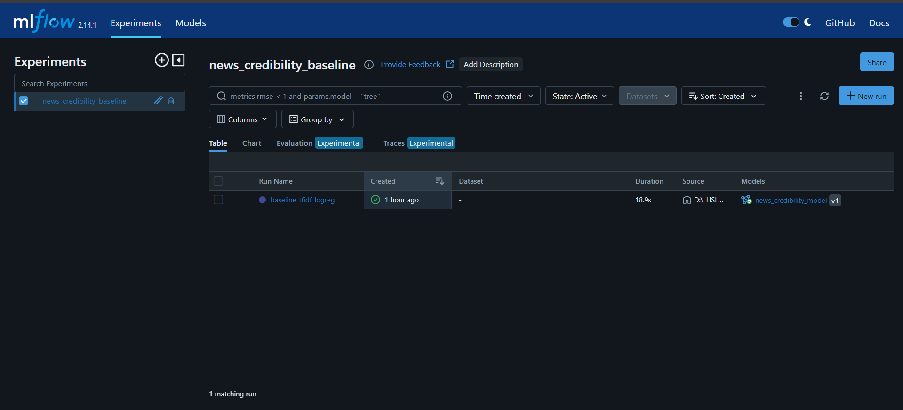
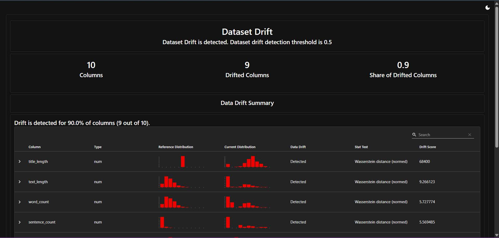
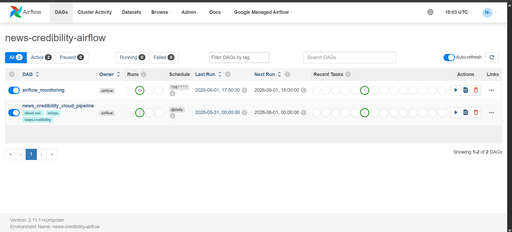

# Real-Time News Credibility Monitoring System

An end-to-end MLOps project that scores the credibility of news articles using machine learning, automated pipelines, experiment tracking, monitoring, and cloud deployment.

---

# 📖 Motivation

Online misinformation spreads quickly, making it difficult for users to evaluate whether a news article is trustworthy. This project explores how Machine Learning and MLOps practices can be combined to build a complete system that automatically analyzes news content and provides a credibility estimate.

The focus of this project is not only model training, but also deployment, monitoring, automation, reproducibility, and cloud infrastructure.

---

# 🚀 Project Introduction

This project implements a complete Feature–Training–Inference–Monitoring (FTIM) architecture.

The system:

- Collects static and live news data
- Builds reusable features
- Trains credibility prediction models
- Tracks experiments using MLflow
- Serves predictions through FastAPI and Streamlit
- Automates workflows using Airflow
- Monitors predictions and drift
- Deploys services on Google Cloud

---

# 🎥 Demo
## Screenshots
### Architechture
<p align="center">
  
</p>

### Streamlit
<p align="center">
  <a href="https://news-credibility-ui-727182253496.europe-west1.run.app/">
    
  </a>
  <a href="https://news-credibility-ui-727182253496.europe-west1.run.app/">
    
  </a>
</p>

### MLflow
<p align="center">
  <a href="https://news-credibility-mlflow-727182253496.europe-west1.run.app/">
    
  </a>
</p>

### Evidently
<p align="center">
  
</p>

### Airflow UI
<p align="center">
  
</p>


## Sample Prediction

```json
{
  "prediction_label": "real",
  "confidence": 0.5137,
  "credibility_score": 51,
  "risk_level": "Medium"
}
```

---

# 📊 Data Sources

## Static Training Data

### LIAR Dataset

- Political claims with fact-check labels
- Public benchmark dataset
- Binary label mapping for training

### FakeNewsNet

- Real and fake news articles
- PolitiFact and GossipCop sources

## Live Data Sources

- RSS Feeds
- NewsAPI (optional)
- Web Scraping using BeautifulSoup (optional)

---

# 🏗️ FTIM Architecture

## Feature Pipeline

Responsibilities:

- Static dataset ingestion
- RSS ingestion
- NewsAPI ingestion
- Article scraping
- Feature generation
- Feature storage

Main files:

```text
src/ingestion/
src/features/
```

## Training Pipeline

Responsibilities:

- Model training
- Evaluation
- MLflow logging
- Model registration

Main files:

```text
src/training/train_baseline.py
src/training/train_bert.py
```

## Inference Pipeline

Responsibilities:

- Prediction generation
- FastAPI endpoint
- Streamlit interface

Main files:

```text
src/inference/
app/
```

## Monitoring Pipeline

Responsibilities:

- Prediction monitoring
- Risk distribution tracking
- Evidently drift reports

Main files:

```text
src/monitoring/
```

---

# ⚙️ Technical Architecture

## Training Workflow

```text
Raw Data
    ↓
Preprocessing
    ↓
Feature Engineering
    ↓
Model Training
    ↓
Evaluation
    ↓
MLflow Tracking
    ↓
Model Registry
    ↓
Deployment
```

## Live Workflow

```text
RSS Feeds / NewsAPI
          ↓
Cloud Composer (Airflow)
          ↓
Cloud Run Job
          ↓
Data Ingestion
          ↓
Feature Generation
          ↓
Prediction
          ↓
Monitoring
          ↓
Reports
```

---

# ☁️ Cloud Architecture

```text
User
 ↓
Streamlit UI (Cloud Run)
 ↓
FastAPI Service (Cloud Run)
 ↓
ML Model

Cloud Composer
 ↓
Cloud Run Job
 ↓
RSS Ingestion
 ↓
Feature Generation
 ↓
Prediction
 ↓
Monitoring
```

## Google Cloud Services

| Service | Purpose |
|----------|----------|
| Cloud Run API | Prediction endpoint |
| Cloud Run UI | Streamlit dashboard |
| Cloud Run Job | Automated live pipeline |
| Cloud Composer | Managed Airflow |
| MLflow | Experiment tracking |
| Artifact Registry | Docker image storage |

---

# 🛠️ Tech Stack

| Category | Technologies |
|-----------|-------------|
| Language | Python |
| Data Processing | Pandas, NumPy |
| Machine Learning | Scikit-learn, PyTorch |
| Feature Engineering | TF-IDF |
| API | FastAPI |
| Dashboard | Streamlit |
| Tracking | MLflow |
| Orchestration | Airflow, Cloud Composer |
| Monitoring | Evidently |
| Containerization | Docker |
| Cloud | Google Cloud Platform |
| Deployment | Cloud Run |
| Registry | Artifact Registry |
| Testing | Pytest |
| CI/CD | GitHub Actions |

---

# 🔧 Installation

```bash
git clone https://github.com/realking46/real-time-news-credibility.git

cd real-time-news-credibility

python -m venv .venv

pip install -r requirements.txt
```

---

# 🔬 Reproducing Results

### NOTE
To showcase the prototype and working of this project, Some of the commands are listed below.

## Static Pipeline

```bash
python -m src.ingestion.load_static_data
python -m src.features.build_features
python -m src.training.train_baseline
```

## Live Pipeline

```bash
python -m src.ingestion.rss_ingest
python -m src.features.build_live_features
python -m src.inference.predict_live_news
python -m src.monitoring.prediction_monitor
```

## Evidently Report

```bash
python -m src.monitoring.evidently_report
```

## FastAPI

```bash
uvicorn src.inference.api:app --reload
```

## Streamlit

```bash
streamlit run app/streamlit_app.py
```

## MLflow

```bash
mlflow ui
```

---

# 🐳 Docker

```bash
docker compose up --build
```

Services:

- FastAPI
- Streamlit
- MLflow

---

# 🔄 Airflow Automation

```bash
docker compose -f docker-compose.airflow.yml up --build
```

DAG:

```text
ingest_live_news
    ↓
build_live_features
    ↓
predict_live_news
    ↓
monitor_predictions
    ↓
evidently_report
```

---

# 📈 MLflow Tracking

Tracked information:

- Parameters
- Accuracy
- Precision
- Recall
- F1 Score
- Model Artifacts
- Model Versions

---

# 🧪 Testing

```bash
python -m pytest
```

# Cloud Deployment

### repo link
```
https://console.cloud.google.com/artifacts?project=graphic-outlook-489716-n6
```
### Streamlit UI
```
https://news-credibility-ui-727182253496.europe-west1.run.app/
```
### Api
```
https://news-credibility-api-727182253496.europe-west1.run.app/
```
### MLflow
```
https://news-credibility-mlflow-727182253496.europe-west1.run.app/
```
### Airflow
Cloud Composer Airflow is not publicly accessible by default for security reasons.
So screenshots are added.


---

# 📁 Project Structure

```text
real-time-news-credibility/
├── app/
├── airflow/
├── cloud_composer_dags/
├── data/
├── docs/
├── models/
├── mlruns/
├── reports/
├── src/
├── tests/
├── Dockerfile*
├── docker-compose.yml
├── requirements.txt
└── README.md
```

---

## ⚠️ Technical Challenges

1. Different RSS and dataset formats
2. Cloud deployment of multiple services
3. Airflow orchestration
4. Experiment tracking and model versioning
5. Reproducibility across environments

Solutions:

- Unified preprocessing
- Docker containers
- Airflow automation
- MLflow tracking
- CI/CD workflows

---

## 🔮 Future Work

- DistilBERT deployment
- Automated retraining
- Feast/Hopsworks feature store
- Cloud SQL + GCS MLflow backend
- Kafka streaming architecture
- Source-level credibility features

---

## 📌 Known Limitations

- RSS data has no ground-truth labels
- Baseline model prioritizes reproducibility
- Credibility score is model-based
- NewsAPI requires API keys
- Does not auto train

---

## 👨‍💻 Author

**Nishant Singh**
- HSLU MLOps Project (Spring 2026)

GitHub:

https://github.com/realking46

---

## 📄 License

Licensed under the MIT License.
